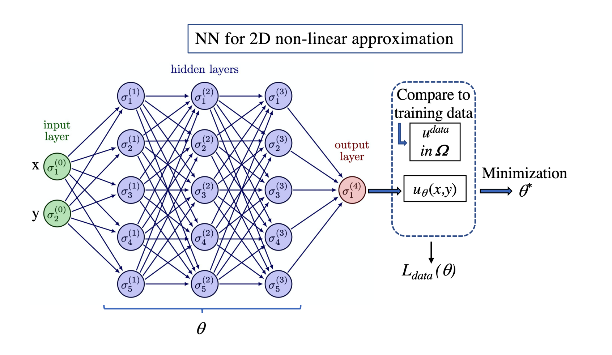

# Physics-Informed Neural Networks

## Problem statement for 2D direct problems

We consider a partial differential equation (PDE) written in the following residual form as, 
$$
\begin{equation}
    \mathcal{F}(u,x,y,u_x,u_y,...)=0,\quad(x,y)\in\Omega,
\end{equation}
$$
where $u(x,y)$ denotes the desired solution and $u_x, u_y, ...$ are the required associated partial derivatives of different orders with respect to $x$ and $y$. Specific conditions must be also imposed at the domain boundary $\partial \Omega$ depending on the problem (see below in the paper).

Note that the $(x,y)$ space variables can also include non-cartesian coordinates (see Lane-Emden equation).

## Problem statement for parametric and inverse problems

We consider a partial differential equation (PDE) written in the following residual form as, 
$$
\begin{equation}
    \mathcal{F}(u,x,y,u_x,u_y,...,\theta)=0,\quad x\in\Omega,\quad\mu\in\Omega_{p},
\end{equation}
$$
where the desired solution is now $u(x,\mu)$, with $x$ being the space variable associated to the one dimensional domain $\Omega$ and $\mu$ is a scalar parameter taking different values in $\Omega_{p}$. For parametric problems, $\mu$ is treated exactly as a second variable in a 2D direct problem, but for inverse problems $\mu$ is consequently considered as an unknown. Boundary conditions (BC) are again necessary for parametric problems, but additional conditions, such as knowledge of the solution at some $x$ values must be added for inverse problems.

Note that, for the sake of simplicity, we have considered only one dimensional space variable in this work for parametric and inverse problems. The extension to higher spatial dimensions is however straightforward.

## Classical deep learning approach with neural networks using training data

In the classical deep learning approach with neural networks (NNs), the model is trained exclusively using available training data. This method involves feeding input data into the neural network, which then adjusts its internal parameters through a training process to minimize the difference between predicted and actual output values. The model learns patterns and relationships within the training dataset to make predictions on new, unseen data. This approach is common in various machine learning applications, where the emphasis is on leveraging labeled training examples to achieve accurate predictions. In this way, NNs serve as non-linear approximators.

||
|:--|
|*Figure 1: Schematic representation of the structure for a Neural Network (NN) applied to a non-linear approximation problem. The input layer has two input variables (i.e. two neurons) for the two space coordinate variables $x$ and $y$. Three hidden layers with five neurons per layer are connected with the input and the output layer, where the latter has a single variable (one neuron) representing the predicted solution $u_{\theta}(x,y)$. The minimization procedure using the loss function $L_{data}(\theta)$ is obtained by comparing $u_{\theta}$ to a training data set of values $u^{data}$ taken in the 2D domain $\Omega$. In this simplified example, $\theta$ represents a total number of 81 scalar parameters.*|

**Approximating the solution with a neural network.**  For any input $\boldsymbol{x}$ representing either the spatial coordinates $(x,y)$, or the combination of variables $(x,\mu)$, or only $x$, depending on the problems, we want to be able to compute an approximation of the solution value $u(\boldsymbol{x})$ and eventually the paremter value $\mu$ (for inverse problems).

For this, we introduce what is called a multi-layer perceptron, which is one of the most common kind of neural networks. Note that any other statistical model could alternatively be used. The goal is to calibrate its parameters $\theta$ such that $u_{\theta}$ approximates the target solution $u(\boldsymbol{x})$. $u_{\theta}$ is a non-linear approximation function, organized into a sequence of $L+1$ layers. The first layer $\mathcal{N}^0$ is called the input layer and is simply:
$$
\begin{equation}
    \mathcal{N}^0(\boldsymbol{x}) = \boldsymbol{x}.
\end{equation}
$$
Each subsequent layer $l$ is parameterized by its weight matrix $W^l\in\mathbb{R}^{d_{l-1}\times d_{l}}$ and a bias vector $\boldsymbol{b}^{l}\in\mathbb{R}^{d_{l}}$, with $d_{l}$ defined as the output size of layer $l$. Layers $l$ with $l\in[1,L-1]$ are called hidden layers, and their output value can be defined recursively:
$$
\begin{equation}
    \mathcal{N}^{l}(\boldsymbol{x})=\sigma(\boldsymbol{W}^{l}\mathcal{N}^{l-1}(\boldsymbol{x})+\boldsymbol{b}^{l}),
\end{equation}
$$
where $\sigma$ is a non-linear function, generally called activation function. While the most commonly used once is the ReLU ($\mathrm{ReLU}(\boldsymbol{x})=\mathrm{max}(\boldsymbol{x},0)$), we use the hyperbolic tangent $\tanh$ in this work, which is more suited than $\mathrm{ReLU}$ for building PINNs. The final layer is the output layers, defined as follows:
$$
\begin{equation}
    \mathcal{N}^{L}(\boldsymbol{x})=\boldsymbol{W}^{L}\mathcal{N}^{L-1}(\boldsymbol{x})+\boldsymbol{b}^{L}.
\end{equation}
$$
Finally, the full neural network $u_{\theta}$ is defined as $u_{\theta}(\boldsymbol{x})=\mathcal{N}^{L}(\boldsymbol{x})$. It can be also written as a sequence of non-linear functions
$$
\begin{equation}
    u_{\theta}(\boldsymbol{x})=\left(\mathcal{N}^{L}\circ\mathcal{N}^{L-1}\circ\ldots\circ\mathcal{N}^{1}\circ\mathcal{N}^{0}\right)(\boldsymbol{x}).
\end{equation}
$$
where $\circ$ denotes the function composition and $\theta=\{\boldsymbol{W}^{l},\boldsymbol{b}^{l}\}_{l=1,L}$ represents the paremters of the network.

**Supervised learning approach using training data.** The classical supervised learning approach assumes that we have at our disposal a dataset of $N_{data}$ known input-outputs pairs $(\boldsymbol{x}, u)$:
$$
\begin{equation}
    \mathcal{D}=\left\{\left(\boldsymbol{x}_{i}^{data},u_{i}^{data}\right)\right\}_{i=1}^{N_{data}},
\end{equation}
$$
for $i\in[1,N_{data}]$. $u_{\theta}$ is considered to be a good approximation of $u$ if predictions $u_{\theta}(\boldsymbol{x}_{i})$ are close to target outputs $u_{i}^{data}$ for every data samples $i$. We want to minimize the prediction error on the dataset, hence it's natural to search for a value $\theta^{*}$ solution of the following optimization problem:
$$
\begin{equation}
    \theta^{*}=\argmin_{\theta}L_{data}(\theta),
\end{equation}
$$
with
$$
\begin{equation}
    L_{data}(\theta)=\frac{1}{N_{data}}\sum_{i=1}^{N_{data}}\left|u_{\theta}(\boldsymbol{x}_{i})-u_{i}^{data}\right|^{2}.
\end{equation}
$$
$L_{data}$ is called the loss function, and equation (8) the learning problem.