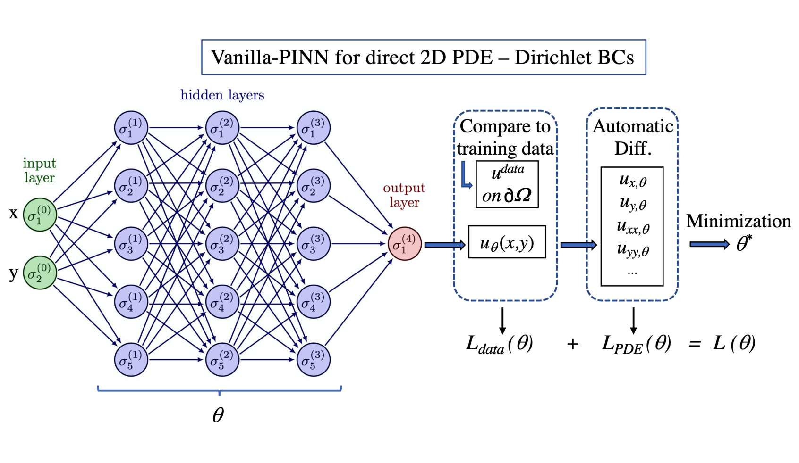

# Physics-Informed Neural Networks

## Problem statement for 2D direct problems

다음과 같은 잔차식으로 쓰여진 편미분 방정식(PDE)을 고려해 보겠습니다. 
```math
\begin{equation}
\mathcal{F}(u,x,y,u_x,u_y,...)=0,\quad(x,y)\in\Omega,
\end{equation}
```
여기서 $u(x,y)$는 원하는 해를 나타내고 $u_x, u_y, ...$는 $x$와 $y$에 대해 다른 차수의 필요한 관련 편미분을 나타냅니다. 문제에 따라 도메인 경계 $\partial \Omega$에 특정 조건도 부과해야 합니다(아래 논문 참조).

$(x,y)$ 공간 변수에는 데카르트 좌표가 아닌 좌표도 포함될 수 있습니다(레인-엠덴 방정식 참조).

## Problem statement for parametric and inverse problems

다음과 같은 잔차 형식으로 작성된 편미분 방정식(PDE)을 고려합니다, 
```math
\begin{equation}
\mathcal{F}(u,x,y,u_x,u_y,...,\theta)=0,\quad x\in\Omega,\quad\mu\in\Omega_{p},
\end{equation}
```
여기서 원하는 해는 이제 $u(x,\mu)$이며, $x$는 1차원 영역 $\Omega$에 관련된 공간 변수이고 $\mu$는 $\Omega_{p}$에서 다른 값을 갖는 스칼라 매개변수입니다. 파라메트릭 문제의 경우 $\mu$는 2D 직접 문제에서 정확히 두 번째 변수로 취급되지만, 역 문제의 경우 $\mu$는 결과적으로 미지수로 간주됩니다. 파라메트릭 문제에는 경계 조건(BC)이 다시 필요하지만 역문제에는 일부 $x$ 값에서의 해에 대한 지식과 같은 추가 조건이 추가되어야 합니다.

단순화를 위해 이 작업에서는 파라메트릭 및 역문제에 대해 1차원 공간 변수만 고려했습니다. 그러나 더 높은 공간 차원으로 확장하는 것은 간단합니다.

## Classical deep learning approach with neural networks using training data

신경망(NN)을 사용하는 고전적인 딥러닝 접근 방식에서는 사용 가능한 훈련 데이터만을 사용하여 모델을 훈련합니다. 이 방법은 입력 데이터를 신경망에 입력하면 신경망이 학습 과정을 통해 내부 파라미터를 조정하여 예측값과 실제 출력값의 차이를 최소화하는 방식입니다. 모델은 학습 데이터 세트 내의 패턴과 관계를 학습하여 보이지 않는 새로운 데이터에 대한 예측을 수행합니다. 이 접근 방식은 다양한 머신 러닝 애플리케이션에서 일반적으로 사용되며, 정확한 예측을 위해 레이블이 지정된 학습 예제를 활용하는 데 중점을 둡니다. 이러한 방식으로 NN은 비선형 근사치 역할을 합니다.

||
|:--|
|*Figure 1: 비선형 근사 문제에 적용된 신경망(NN)의 구조를 개략적으로 나타낸 도식. 입력 레이어에는 두 개의 공간 좌표 변수 $x$와 $y$에 대한 두 개의 입력 변수(즉, 두 개의 뉴런)가 있습니다. 각 층마다 5개의 뉴런이 있는 3개의 숨겨진 층이 입력 및 출력 층과 연결되며, 후자는 예측된 해 $u_{\theta}(x,y)$를 나타내는 단일 변수(뉴런 1개)를 가집니다. 손실 함수 $L_{data}(\theta)$를 사용하는 최소화 절차는 $u_{\theta}$를 2D 영역 $\Omega$에서 가져온 값 $u^{data}$의 훈련 데이터 세트와 비교하여 얻습니다. 이 단순화된 예에서 $\theta$는 총 81개의 스칼라 파라미터를 나타냅니다.*|

**신경망으로 해의 근사값 계산하기** 문제에 따라 공간 좌표 $(x,y)$ 또는 변수 $(x,\mu)$의 조합 또는 $x$만을 나타내는 입력 $\boldsymbol{x}$에 대해, 우리는 해의 근사값 $u(\boldsymbol{x})$와 최종적으로 (역 문제의 경우) 매개 변수 값 $\mu$를 계산할 수 있기를 원합니다.

이를 위해 가장 일반적인 종류의 신경망 중 하나인 다층 퍼셉트론이라는 것을 소개합니다. 다른 통계 모델을 대신 사용할 수도 있습니다. 목표는 $u_{\theta}$가 목표 솔루션 $u(\boldsymbol{x})$에 근사하도록 파라미터 $\theta$를 보정하는 것입니다. $u_{\theta}$는 일련의 $L+1$ 레이어로 구성된 비선형 근사 함수입니다. 첫 번째 레이어 $\mathcal{N}^0$을 입력 레이어라고 하며 간단히:
```math
\begin{equation}
\mathcal{N}^0(\boldsymbol{x}) = \boldsymbol{x}.
\end{equation}
```
각 후속 레이어 $l$은 가중 행렬 $W^l\in\mathbb{R}^{d_{l-1}\times d_{l}}$과 바이어스 벡터 $\boldsymbol{b}^{l}\in\mathbb{R}^{d_{l}}$로 파라미터화되며, $d_{l}$는 레이어 $l$의 출력 크기로 정의됩니다. $l\in[1,L-1]$를 숨겨진 레이어라고 하며, 그 출력값은 재귀적으로 정의할 수 있습니다:
```math
\begin{equation}
\mathcal{N}^{l}(\boldsymbol{x})=\sigma(\boldsymbol{W}^{l}\mathcal{N}^{l-1}(\boldsymbol{x})+\boldsymbol{b}^{l}),
\end{equation}
```
여기서 $\sigma$는 일반적으로 활성화 함수라고 하는 비선형 함수입니다. 가장 일반적으로 사용되는 것은 $\mathrm{ReLU}(\boldsymbol{x})=\mathrm{max}(\boldsymbol{x},0)$이지만, 이 작업에서는 $\mathrm{ReLU}$보다 PINN 구축에 더 적합한 쌍곡탄젠트 $\tanh$를 사용합니다. 마지막 레이어는 다음과 같이 정의된 출력 레이어입니다:
```math
\begin{equation}
\mathcal{N}^{L}(\boldsymbol{x})=\boldsymbol{W}^{L}\mathcal{N}^{L-1}(\boldsymbol{x})+\boldsymbol{b}^{L}.
\end{equation}
```
마지막으로, 전체 신경망 $u_{\theta}$는 $u_{\theta}(\boldsymbol{x})=\mathcal{N}^{L}(\boldsymbol{x})$로 정의됩니다. 비선형 함수의 시퀀스로도 쓸 수 있습니다.
```math
\begin{equation}
u_{\theta}(\boldsymbol{x})=\left(\mathcal{N}^{L}\circ\mathcal{N}^{L-1}\circ\ldots\circ\mathcal{N}^{1}\circ\mathcal{N}^{0}\right)(\boldsymbol{x}).
\end{equation}
```
여기서 $\circ$은 함수 구성을 나타내고 $\theta=\{\boldsymbol{W}^{l},\boldsymbol{b}^{l}\}_{l=1,L}$은 네트워크의 매개변수를 나타냅니다.

**훈련 데이터를 사용한 지도 학습 접근 방식** 고전적인 지도 학습 접근 방식은 알려진 입출력 쌍 $(\boldsymbol{x}, u)$의 데이터 세트 $N_{data}$를 마음대로 사용할 수 있다고 가정합니다:
```math
\begin{equation}
    \mathcal{D}=\left\{\left(\boldsymbol{x}_{i}^{data},u_{i}^{data}\right)\right\}_{i=1}^{N_{data}},
\end{equation}
```
$i\in[1,N_{data}]$에 대해 $u_{\theta}$는 모든 데이터 샘플 $i$에 대해 예측 $u_{\theta}(\boldsymbol{x}_{i})$가 목표 출력 $u_{i}^{data}$에 가깝다면 $u$의 좋은 근사치로 간주됩니다. 데이터 세트의 예측 오차를 최소화하고 싶기 때문에 다음 최적화 문제의 $\theta^{*}$ 해를 찾는 것이 자연스럽습니다:
```math
\begin{equation}
    \theta^{*}=\mathrm{arg\underset{\theta}\,min}L_{data}(\theta),
\end{equation}
```
와
```math
\begin{equation}
    L_{data}(\theta)=\frac{1}{N_{data}}\sum_{i=1}^{N_{data}}\left|u_{\theta}(\boldsymbol{x}_{i})-u_{i}^{data}\right|^{2}.
\end{equation}
```
$L_{data}$를 손실 함수, 방정식 (8)을 학습 문제라고 합니다. 정의된 손실 함수는 평균 제곱 오차 공식에 의존하지만, 다른 공식도 가능하다는 점에 유의할 필요가 있습니다. 방정식 (8)을 푸는 것은 일반적으로 (확률적) 경사 하강 알고리즘을 통해 이루어집니다. 이 알고리즘은 자동 미분 기법을 사용하여 네트워크 파라미터 $\theta$에 대한 손실 $L_{data}$의 기울기를 계산합니다. 이 알고리즘은 미리 정의된 정확도 기준 또는 지정된 최대 반복 횟수에 따라 최소값에 수렴할 때까지 반복적으로 적용됩니다,
```math
\begin{equation}
    \theta^{(j+1)}=\theta^{(j)}-l_{r}\nabla_{\theta}L_{data}(\theta^{(j)}),
\end{equation}
```
에서 $L=L_{data}$로, $j$ 번째 반복은 문헌에서 에포크라고도 하며, 여기서 $l_{r}$을 학습 속도 파라미터라고 합니다. 이 작업에서는 잘 알려진 아담 최적화 알고리즘을 선택합니다. 이 알고리즘은 손실을 줄이기 위해 네트워크 파라미터 $(\theta)$를 기울기의 반대 방향으로 반복적으로 업데이트하는 것을 포함할 가능성이 높습니다. 표준 자동 미분 기법은 NN 파라미터, 즉 가중치와 편향에 대한 파생물을 계산하는 데 필요합니다(Baydin et al., 2018). 이 기법은 복소함수 계산의 다양한 단계를 저장한 다음 연쇄 규칙을 사용하여 기울기를 계산하는 것으로 구성됩니다. 실제로는 특히 Python으로 작업할 때 TensorFlow나 PyTorch와 같은 오픈 소스 소프트웨어 라이브러리를 활용하면 학습 과정이 크게 간소화됩니다. 이러한 라이브러리는 신경망 모델을 구축, 훈련 및 최적화하기 위해 미리 구현된 함수와 도구를 제공합니다. TensorFlow와 PyTorch는 사용자 친화적인 인터페이스, 광범위한 문서, 풍부한 커뮤니티 지원을 제공하기 때문에 딥 러닝 분야의 연구자와 실무자들이 많이 선택합니다. 이 작업에서는 직접 문제에는 TensorFlow 라이브러리를 사용하고 파라메트릭 및 역문제에는 PyTorch를 선호한다는 점에 유의하세요.

||
|:--|
|Figure 2: 디리클레와 같은 BC(연성 제약 조건)가 있는 2D 직접 문제와 관련된 PDE를 푸는 데 적용된 물리 정보 신경망의 구조를 개략적으로 나타낸 도식. 입력 레이어에는 두 개의 공간 좌표 변수 $x$와 $y$에 대한 두 개의 입력 변수(즉, 두 개의 뉴런)가 있습니다. 각 층마다 뉴런이 5개씩 있는 3개의 숨겨진 층이 입력 및 출력 층과 연결되며, 후자는 예측된 해 $u_{\theta}(x,y)$를 나타내는 단일 변수(뉴런 1개)를 가집니다. 이 절차에서 자동 미분(AD)은 PDE 손실 함수 $L_{PDE}(\theta)$를 형성하는 데 필요한 부분 도함수(즉, $u_{x,\theta}, u_{xy,\theta},...$)를 평가하기 위해 사용됩니다. 손실 함수 $L_{data}(\theta)$는 경계 영역 $\partial\Omega$에 소프트 제약 조건(즉, 훈련 데이터 집합을 통해)을 적용하여 구할 수 있습니다.|